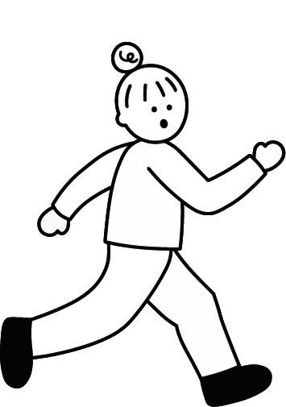
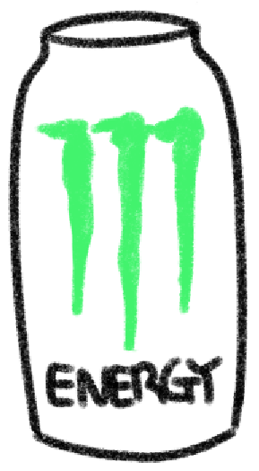

# JongGangRun Game Document 🚀

>**Name:** Nayeong Kim

>**Student ID:** 20180057

>**Repository URL:** [Project 1 Link](http://git.prototyping.id/20180057/project1)


## Game Description 
The game ‘**JongGangRun**’ is for college students who wish to finish their semester as fast as possible.

A lot of obstacles such as exams and assignments, make students hard to finish their semester. How about playing games instead? You can quickly finish your semester by jumping over the obstacles and can see your grade, right away!

## Game Rule
> The basic rule of this game.

- Runner have 4 `life`.
- Runner can jump by pressing `mouse` or `space bar`
  - You can jump once, and jump twice!
- Runner must avoid various `obstacles` (6 obstacle in total)
  - When Runner hits `obstacle`, runner lose one `life`. 
  - When `life` become zero, game ends immediately.
- Runner can be invincible by drinking `EnergyDrink` (lasts for 10 seconds)
  - You can kick off the obstacles!
- Runner can earn `points` (10 points for each coin)
  - Depending on the point score, runner gets grade (From A+ to F)

>How To win 😊

  Earn as many points as you can before you lose all of your `life`!

  If so, you can get a good grade!


### Introducing Characters In Game

| Name | Image | Detail | motion |
| :----: | :------: | :------: | :------: |
| **Runner** |  | The main character of the game | Runner moves its arm and leg! |
| **Random quiz** |  | Makes many students terrified | It falls down to the ground |
| **Bunch of assignment** |  | One reason why many Students can't sleep | no extra motion |
| **COVID 19** |  | If you get COVID you might fall behind... | It rotates and rolls in a fast speed |
| **Laptop with Blue screen**|  | Laptop with blue screen is scarier than any other horror movie | It blinks with a blue screen |
| **Endless Exam** |  | This makes a lot of students cry... | Exam contexts is written |
| **Soju** |  | It makes you forget the reality for some times, but also gives a terrible hangover | It looks attractive... it's size varies |
| **Energy Drink** |  | This will boost your enrgy and you can be invincible for a bit | It blinks to attract you! |

## How it works

- `npm run dev` - Starts the development server at port [3000](http://localhost:3000/)
- `npm run build` - Builds the application in a `dist` folder
- `npm run preview` - Serves the build files (`dist` folder) locally at port [5000](http://localhost:3000/)

Note that if after this last command you do not see anything, you can use instead this other command:

- `npm run preview --host` - You should then be able to see your files locally at port [5000](http://localhost:3000/)

## A single p5.js sketch

```js
import '../css/style.css';
import { sketch } from 'p5js-wrapper';

sketch.setup = function () {
  createCanvas(800, 600);
};

sketch.draw = function () {
  background(127); // grey
  fill(255, 0, 0); // red
  noStroke();
  rectMode(CENTER);
  rect(width / 2, height / 2, 50, 50);
};

sketch.mousePressed = function () {
  console.log(`I am here at ${mouseX}:${mouseY}`);
};
```

And here the body of the html file:

```html
<body>
  <script type="module" src="/src/single_sketch.js"></script>
</body>
```

## Multiple p5.js sketches

If you want to use multiple sketches, you need to use a different syntax.

```js
import '../css/style.css';
import { p5 } from 'p5js-wrapper';

let sketch1 = new p5((p) => {
  p.setup = () => {
    const one = document.getElementById('one');
    p.createCanvas(one.clientWidth, one.clientHeight);
  };

  p.draw = () => {
    p.background(100);
  };
}, 'one');

// Sketch2
let sketch2 = new p5((p) => {
  p.setup = () => {
    const two = document.getElementById('two');
    p.createCanvas(two.clientWidth, two.clientHeight);
  };

  p.draw = () => {
    p.background(170);
  };
}, 'two');
```

This file is expecting two divs in the html file:

```html
<body>
  <script type="module" src="/src/multi_sketch.js"></script>
  <div id="one"></div>
  <div id="two"></div>
</body>
```

## Adding sound

Sound is an [experimental feature](https://github.com/makinteract/p5js-wrapper/blob/main/README_SOUND.md).

Examples usage:

```js
import { sketch } from 'p5js-wrapper';
import 'p5js-wrapper/sound';

import mysound from './mysound.mp3';

let soundEffect;

sketch.setup = function () {
  createCanvas(100, 100);
  soundEffect = loadSound(mysound);
};

sketch.draw = function () {
  background('#eeeeee');
};

// Play sound on click
sketch.mousePressed = function () {
  soundEffect.play();
};
```

This example assumes you have a file _mysound.mp3_ in the _src_ folder.

## License

This project is open source and available under the [MIT License](LICENSE).
