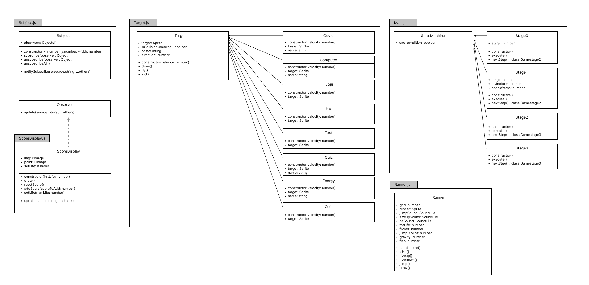

# JongGangRun Game Document 🚀

>**Name:** Nayeong Kim

>**Student ID:** 20180057

>**Repository URL:** [Project 1 Link](http://git.prototyping.id/20180057/project1)


## Game Description 
The game ‘**JongGangRun**’ is for college students who wish to finish their semester as fast as possible.

A lot of obstacles such as exams and assignments, make students hard to finish their semester. How about playing games instead? You can quickly finish your semester by jumping over the obstacles and can see your grade, right away!

## Game Rule
> The basic rule of this game.

- Runner have 4 `life`.
- Runner can jump by pressing `mouse` or `space bar`
  - You can jump once, and jump twice!
- Runner must avoid various `obstacles` (6 obstacle in total)
  - When Runner hits `obstacle`, runner lose one `life`. 
  - When `life` become zero, game ends immediately.
- Runner can be invincible by drinking `EnergyDrink` (lasts for 10 seconds)
  - You can kick off the obstacles!
- Runner can earn `points` (10 points for each coin)
  - Depending on the point score, runner gets grade (From A+ to F)
    - If point is
      - less than 1000 → F
      - more than 1000, less than 3000 → D
      - more than 3000, less than 6000 → C
      - more than 6000, less than 7000 → B
      - more than 7000, less than 8000 → A
      - more than 8000 → A+

>How To win 😊

  Earn as many points as you can before you lose all of your `life`!

  If so, you can get a good grade!


### Introducing Characters In Game


| Name | Image | Detail | motion |
| :----: | :------: | :------: | :------: |
| **Runner** |  | The main character of the game | Runner moves its arm and leg! |
| **Random quiz** |  | Makes many students terrified | It falls down to the ground |
| **Bunch of assignment** |  | One reason why many Students can't sleep | no extra motion |
| **COVID 19** |  | If you get COVID you might fall behind... | It rotates and rolls in a fast speed |
| **Laptop with Blue screen**|  | Laptop with blue screen is scarier than any other horror movie | It blinks with a blue screen |
| **Endless Exam** |  | This makes a lot of students cry... | Exam contexts is written |
| **Soju** |  | It makes you forget the reality for some times, but also gives a terrible hangover | It looks attractive... it's size varies |
| **Energy Drink** |  | This will boost your enrgy and you can be invincible for a bit | It blinks to attract you! |

## How it works
This is my UML.


### Key Class
  `Class StateMachine`
  - This class is in main.js
  - I used State Machine Pattern to divide the stages in game.
  - It is called in draw() and returns the next stage
  - It has 4 stages in Total
    - Stage 0: Game starting page
    - Stage 1: Game playing page
    - Stage 2: Gmae play end. Pause and show `checkpoint` button
    - Stage 3: Show the points and grade
  
  `Class Runner`
  - This class is for the character `runner`
  - Define properties of runner using p5.play
  - Create functions
    - size up()/down()
    - jump() :
    - isHit() : Change animation
  
  `Class Target`
  - This class is for adding properties of characters except runner.
  
  `Class ScoreDisplay`
  - This class draws the `point` and `Life`
  - It is keep updated by the observer


I used p5.play to make detailed motions, such as running or changing frames. Also, I used to check collision and overlaping.

This example shows how I defined the properties using p5.play.

```js
class Coin extends Target {
  constructor(velocity){
      super(velocity);
      this.target.addAnimation("coin_img",'data/coin.png');
      this.target.setCollider('circle', 0,0,60);
      this.target.position.x= 1112;
      this.target.position.y=480;
  }
}
```


## Detail description about Code: Challenging part

`Jumping`
  - When jump, I used animation.stop() to hold the animation.
  - Adjusted velocity up and down to make it look like it's falling with Gravity.
    - gravity=1, flap =16
    - Initial valuse of velocity is 0. When `jump`, velocity= flap, and gravity is added until the runner touch the ground.
    - Since it works with frame, sometimes it can get lower than the ground, so I also adjust the position of y, and make the velocity 0, make animation play()
    - checked jump_count to make it possible unitl twice
  
`Create Obstacle`
  - Create random obstacle in every 60 frame
  - Adjust the postion of coin in coin_array to make the coin be above the obstacle
  - Added unique motions for each obstacle

`Become Invincible`
  - When runner overlap the 'energy'
  - It works for 600 frame.

  - Key points
    - Speed become 1.5 x faster
    - Size 1.25 x bigger
      - Adjust the position again
    - Background color changes
      - From green to white
    - Add bar graph to show the left time
    - It kicks obstacle and does not lose life
       - obstacle moves from left to right with some rotation. (used velocity x,y)
  

**+ I drawed every illust used in this game.**

## Acknowledge any help
- I used p5.play library. I got help from examples in p5.play
